# PROYECTO FIN MÓDULO IAW
### **ÍNDICE**
#### 1. Funcionalidad
#### 2. Archivo Index
#### 3. Controladores
#### 4. Conexión a la base de datos
#### 5. Vistas
#### 6. Modelos
#### 7. Implementación en máquina virtual
#
### **1. FUNCIONALIDAD**
#### Utilizaremos el patrón de diseño MVC para desarrollar la práctica. En este modelo tendremos nuestro index.php aislado del resto de funcionalidades, las cuales implementaremos por separado y llamaremos cuando las necesitemos.
#
#### En el directorio DB tendremos un fichero que se encarga de realizar la conexión con la base de datos
#
#### En el directorio MODELS trabajaremos con los datos de la base de datos.
#
#### En el directorio CONTROLLERS tendremos los controladores de los productos y de los usuarios.
#
#### En el directorio VIEWS tendremos las vistas las cuales sirven para visualizar las diferentes opciones de nuestra página web
#
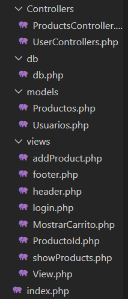
#
### **2. ARCHIVO INDEX**
#### Nuestro archivo Index llamará al header y al footer. En caso de que no reciba un parámetro activo mostrará la página de inicio. Si recibe un parámetro, se instancia el controlador y se invoca la acción indicada
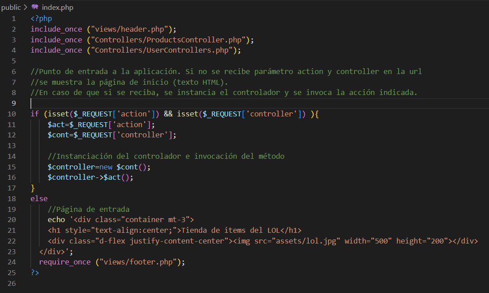
#
### **3. CONTROLADORES**
#### Dentro de nuestra carpeta de controladores tendremos uno para los productos y otro para los usuarios. Ambos se encargarán de validar los datos para que solamente los usuarios registrados puedan iniciar sesión y podamos insertar productos en la base de datos.
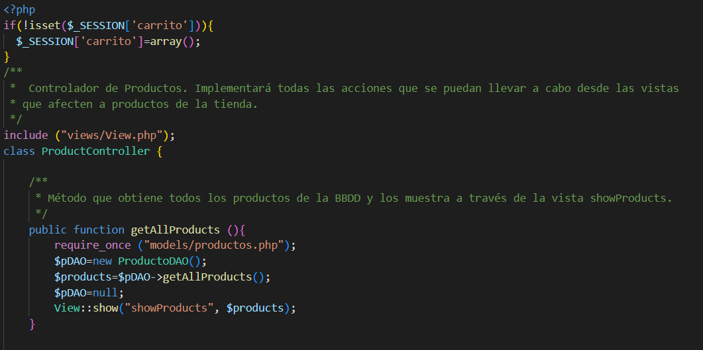
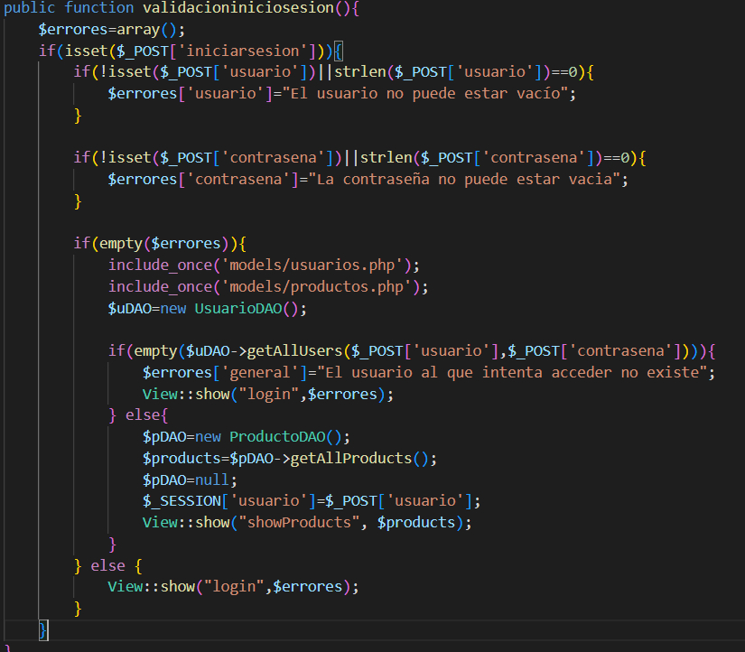
#
### **4. CONEXIÓN A LA BASE DE DATOS**
#### El archivo bd implementará un método estático para poder conectarnos a la base de datos. Para poder hacer esto hará uso de las variables que se encuentran el el fichero .env
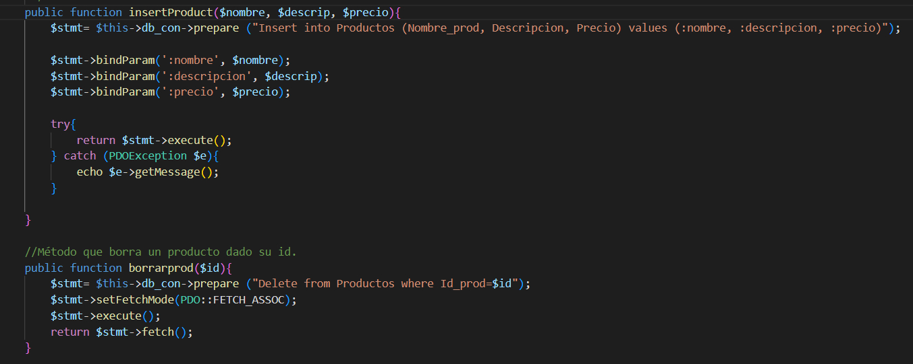
#
### **5. VISTAS**
#### En la carpeta vistas tendremos varios archivos, cada uno de los cuales se encargará de mostrar algo en concreto
#### El footer y el header serán invocados siempre para mostrar las opciones posibles al usuario. Por ello el header deberá controlar si ha iniciado sesión o no para saber qué opciones mostrará en el header.
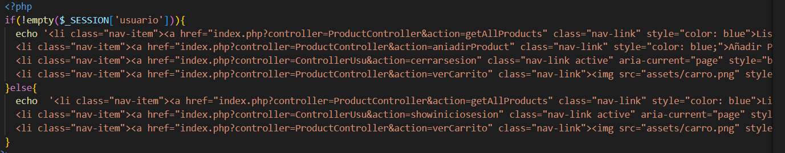

#### También tendremos una vista para cuando el usuario desee añadir un producto.
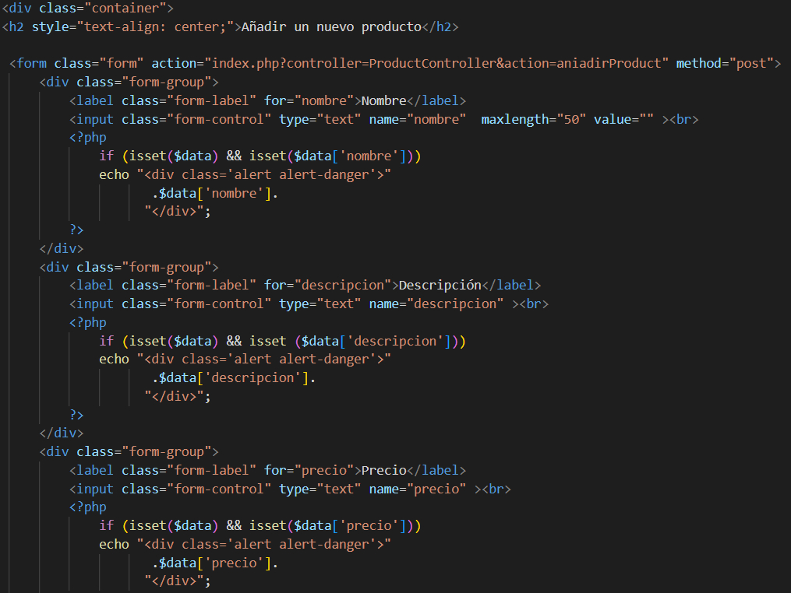
#### Con la vista showProducts podremos visualizar en pantalla los productos que se encuentran almacenados en la base de datos junto a sus características
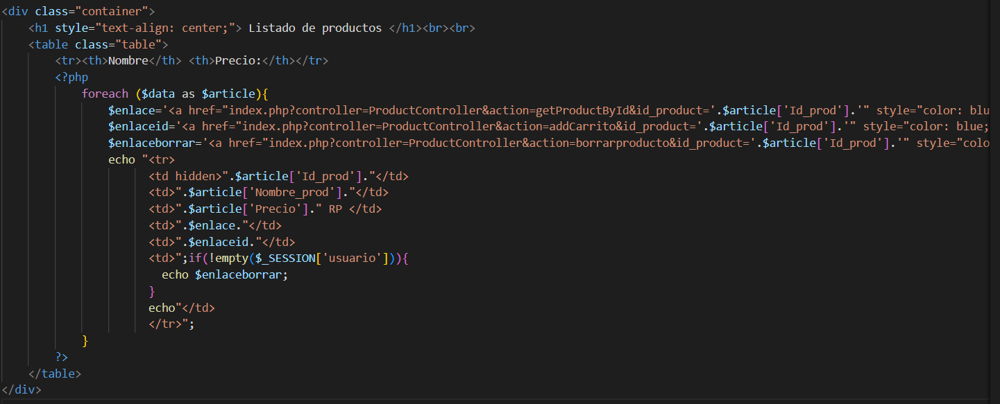
#### También dispondremos de una vista para mostrar el carrito de la compra y otra para el login de los usuarios
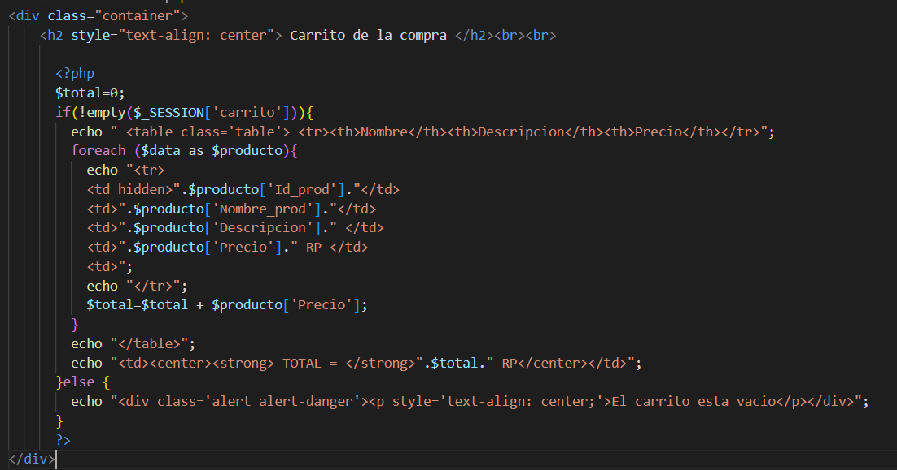
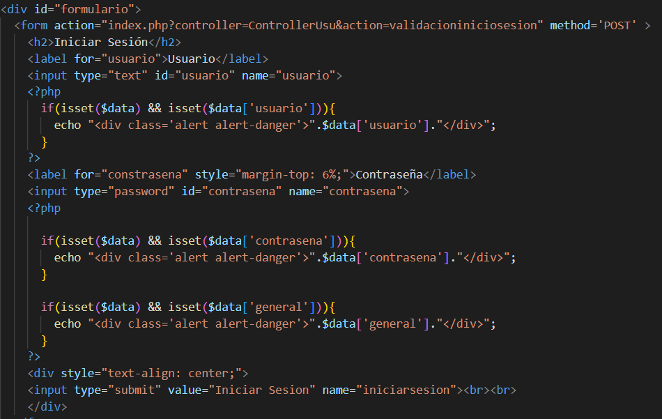
#### Todas estas vistas se mostrarán utilizando el archivo View, el cual invocará a la cabecera y el pie de página además de la vista que le pasemos como parámetro.
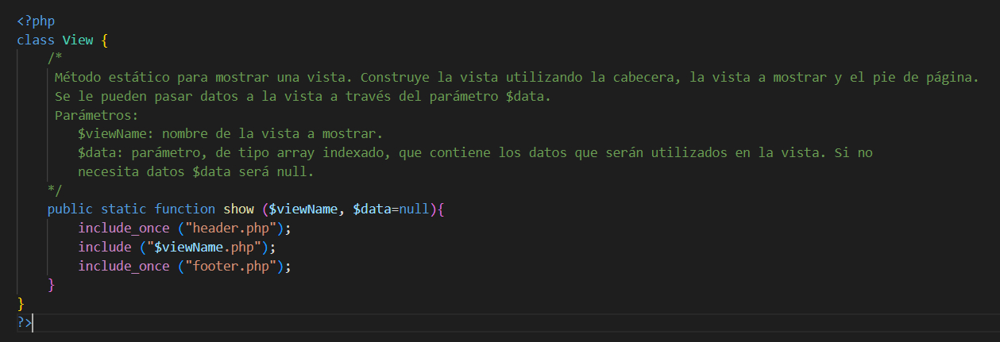
#
### **6. MODELOS**
#### Aquí utilizaremos dos modelos, uno para implementar todos los métodos que necesiten atacar nuestra tabla de productos en la base de datos, y lo mismo haremos para la tabla de los usuarios en los inicios de sesión

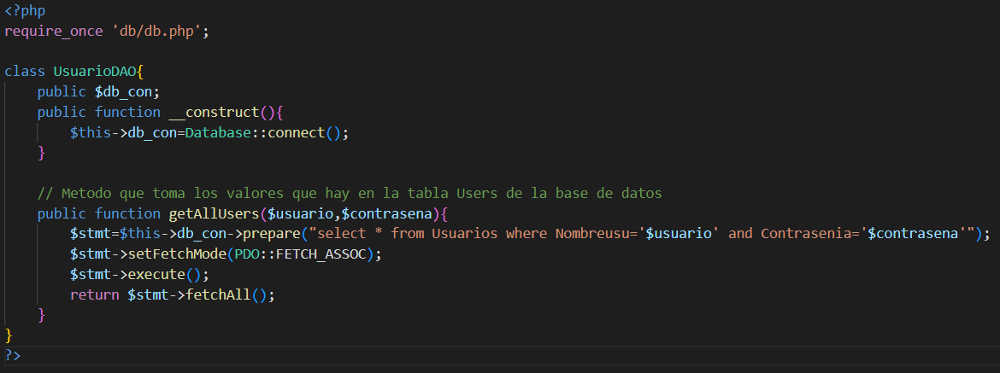
#
### **7. IMPLEMENTACIÓN EN MÁQUINA VIRTUAL**
#### Para empezar nos conectamos por ssh a través de nuestro puerto asignado a nuestra máquina virtual
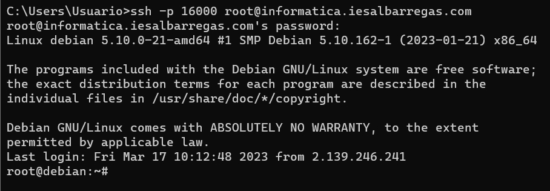
#### Lo primero será actualizar los repositorios con los comandos apt update y apt upgrade.
#### A continuación instalamos docker
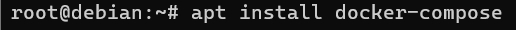
#### A continuación subimos todo nuestro trabajo a un repositorio en github y lo clonamos en la máquina virtual con el comando git clone y la url del repositorio
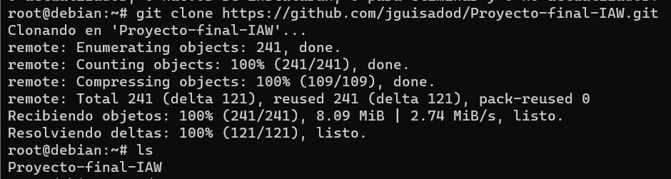
#### Una vez clonado el repositorio levantamos el entorno con el comando docker-compose up
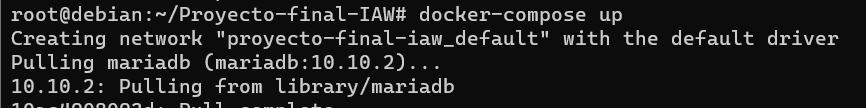
#### Para utilizar la base de datos instalamos mysql-server. Previamente nos hemos ido a HeidiSQL que es donde tenemos nuestra base de datos y la hemos exportado para poder utilizarla en nuestra máquina virtual. Cargamos la base de datos iniciando sesión y pasando el archivo .sql
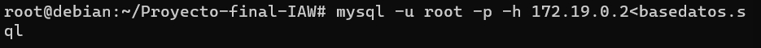
#### Ya teniendo todo configurado, nos vamos al navegador y buscamos el dominio de la pagina utilizando nuestro número de puerto
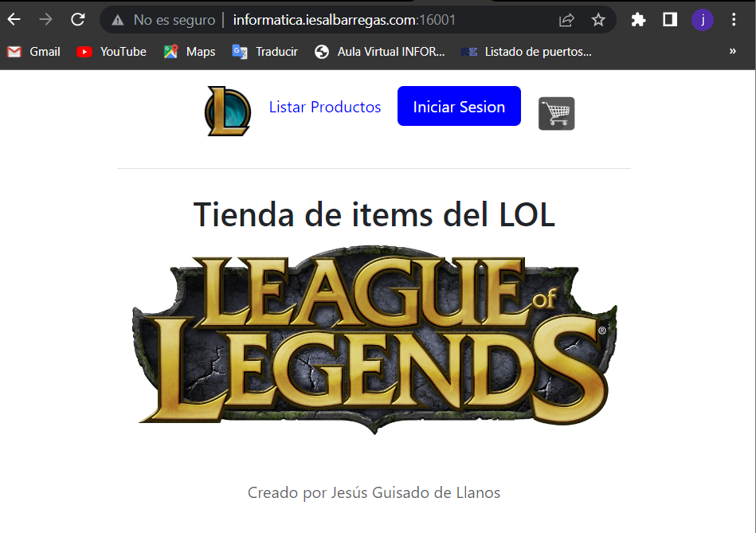
#